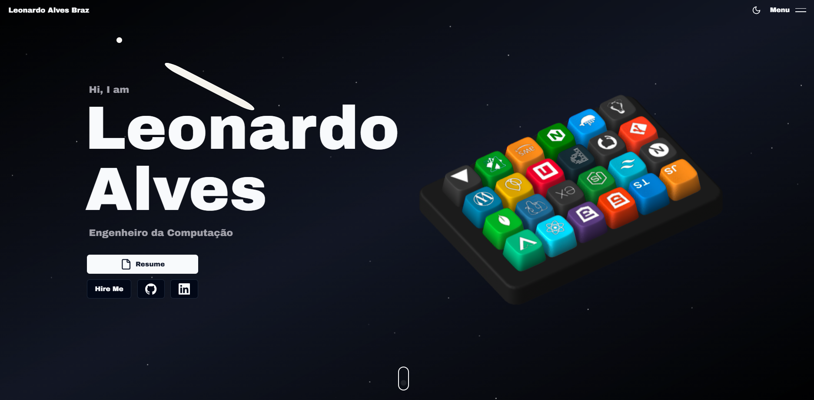

# 🚀 Portfolio Pessoal - Leonardo Alves



Bem-vindo ao repositório do meu portfólio pessoal! 🎉 Este projeto é uma combinação de criatividade, tecnologia e dedicação para apresentar minhas habilidades, projetos e personalidade de forma visualmente atraente e interativa.

## 👨‍💻 Sobre Mim

Sou Leonardo Alves Braz, **Engenheiro da Computação** com foco em **Sistemas Embarcados**, **Machine Learning** e **FULL STACK**. Apaixonado por desenvolver soluções tecnológicas que conectam hardware e software para resolver problemas reais.


## 🔥 Destaques do Portfólio

### 🎹 **Animações 3D Interativas**
- Teclado interativo personalizado feito com **Spline**
- Cada tecla representa uma habilidade tecnológica com títulos e descrições ao passar o mouse
- Interações 3D suaves e responsivas que cativam os visitantes

### ✨ **Interações e Animações Fluidas**
- Alimentado por **GSAP** e **Framer Motion**, oferecendo animações suaves em scroll, hover e revelação de elementos
- Design de movimento criativo que aprimora a narrativa

### 🌌 **Design Temático Espacial**
- Partículas flutuando em um fundo cósmico escuro simulam uma atmosfera espacial
- Visual único e futurista

### 📱 **Design Responsivo**
- Layout totalmente responsivo que funciona perfeitamente em todos os dispositivos
- Otimizado para experiências desktop e mobile

### 💼 **Projetos Destacados**
- **AquaGuard** - Sistema mobile de monitoramento de qualidade da água (Flutter/Firebase)
- **Aura Weather** - App moderno de clima com React, TypeScript e Vite
- **Processamento de Imagens Médicas** - ML aplicado em diagnóstico com TensorFlow e OpenCV
- **Embarca Tech** - Projetos de sistemas embarcados com Raspberry Pi e Arduino
- **Cidade Inteligente** - Soluções IoT para automação urbana

## 🛠️ Stack Tecnológico

- **Frontend:** Next.js 14, React 18, TypeScript, Tailwind CSS, Shadcn UI, Aceternity UI
- **Animações:** GSAP, Framer Motion, Spline Runtime
- **Outras Ferramentas:** Resend, Socket.io, Zod

## 💻 Habilidades Técnicas

- **Linguagens:** Python, C, C++, Java, TypeScript, Dart
- **Mobile:** Flutter, React Native
- **Machine Learning:** TensorFlow, OpenCV, Scikit-learn
- **Sistemas Embarcados:** Arduino, Raspberry Pi, FPGA
- **Web:** React, Next.js, Tailwind CSS
- **IoT & Automação:** Sensores, Comunicação UART/Bluetooth
- **Ferramentas:** Git, Docker, LaTeX, VS Code

## 🌟 Como Executar Localmente

1. Clone este repositório:
   ```bash
   git clone https://github.com/Leonardobrzz/portfolio-pessoal-leonardo-alves.git
   ```

2. Navegue até o diretório do projeto:
   ```bash
   cd portfolio-pessoal-leonardo-alves
   ```

3. Instale as dependências:
   ```bash
   npm install
   ```

4. Configure as variáveis de ambiente (opcional para formulário de contato):
   ```bash
   # Crie um arquivo .env.local na raiz do projeto
   touch .env.local

   # Adicione sua chave API do Resend
   RESEND_API_KEY=sua_chave_resend_aqui
   ```

5. Inicie o servidor de desenvolvimento:
   ```bash
   npm run dev
   ```

6. Abra seu navegador e acesse:
   ```
   http://localhost:3000
   ```

## 🚀 Deploy

Este projeto pode ser facilmente implantado usando **Vercel** para desempenho rápido e facilidade de uso.

### Configurando Resend API no Vercel

1. Crie uma conta no [Resend](https://resend.com) e obtenha sua chave API
2. Vá para as configurações do seu projeto no Vercel
3. Navegue até a seção "Environment Variables"
4. Adicione uma nova variável de ambiente:
   - Nome: `RESEND_API_KEY`
   - Valor: Sua chave API do Resend
5. Salve as alterações e reimplante sua aplicação

**Nota:** Mantenha sua chave API em segredo e nunca a comite no repositório.


## 📬 Contato

Sinta-se à vontade para entrar em contato para colaborações, feedback ou apenas para conversar! 😊

- **Email:** leonardoalves@alu.ufc.br
- **LinkedIn:** [Leonardo Alves Braz](https://www.linkedin.com/in/leonardo-alves-braz/)
- **GitHub:** [Leonardobrzz](https://github.com/Leonardobrzz)

---
